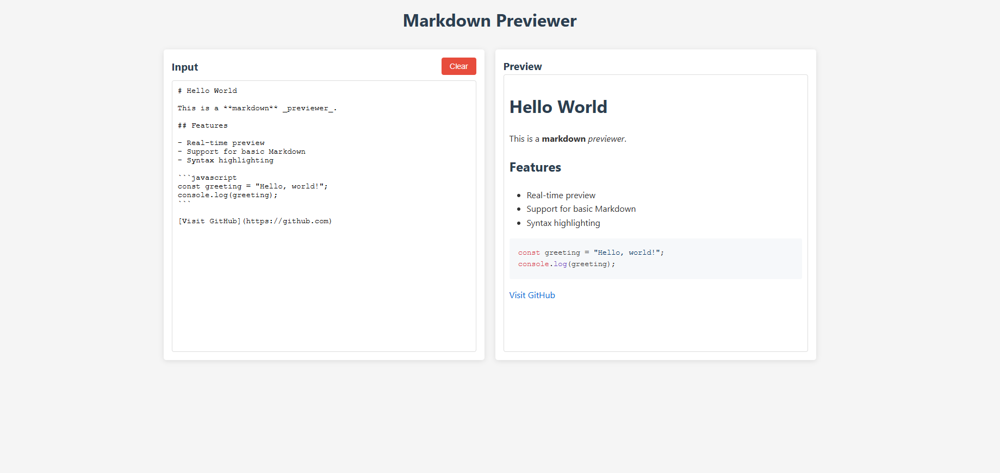
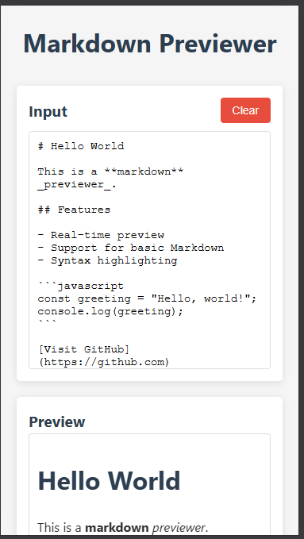

# Markdown Previewer

This is a simple Markdown Previewer built using JavaScript. It allows users to write and preview Markdown in real time.

## Features
- 📝 **Real-time preview** of Markdown
- 💡 **Syntax highlighting** for code blocks
- 🔄 **Supports GitHub Flavored Markdown (GFM)**
- 🧹 **Clear editor button** to reset the input

## Tech Stack
- HTML
- CSS
- JavaScript
- [Marked.js](https://marked.js.org/) for parsing Markdown
- [Highlight.js](https://highlightjs.org/) for syntax highlighting

## How to Use
1. Open `index.html` in a browser.
2. Start typing Markdown in the editor.
3. See the preview update instantly.
4. Click the **Clear** button to reset the editor.

## Screenshots 📸



## Deployment 🌐
[Click here to use](https://markdown-preview-murex.vercel.app/)

## Example Markdown
```
# Hello World

This is a **markdown** _previewer_.

## Features

- Real-time preview
- Support for basic Markdown
- Syntax highlighting

```javascript
const greeting = "Hello, world!";
console.log(greeting);
```

[Visit GitHub](https://github.com)
```

Feel free to modify and improve it! 🚀

